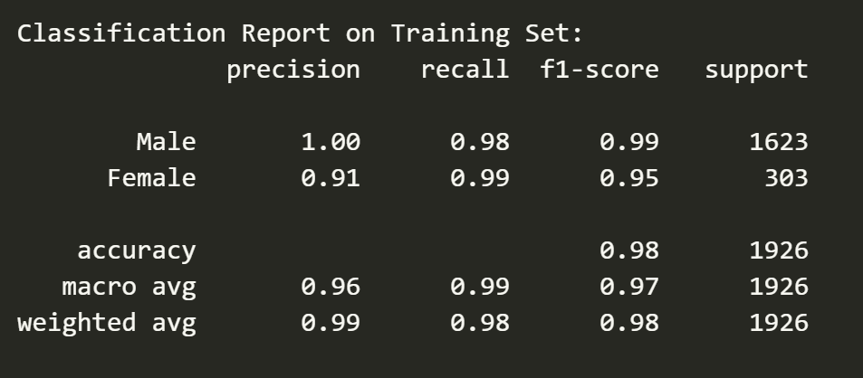
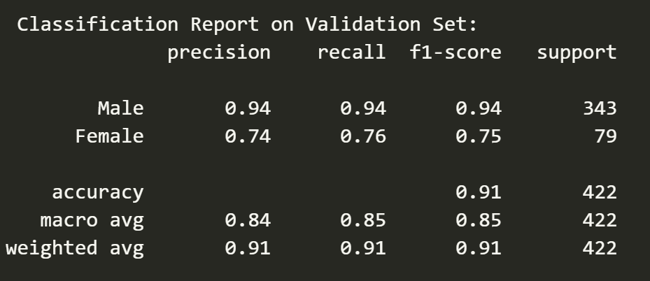
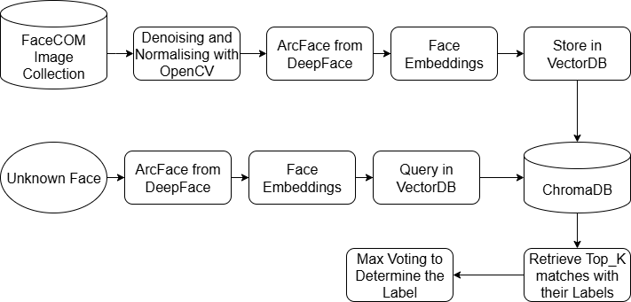
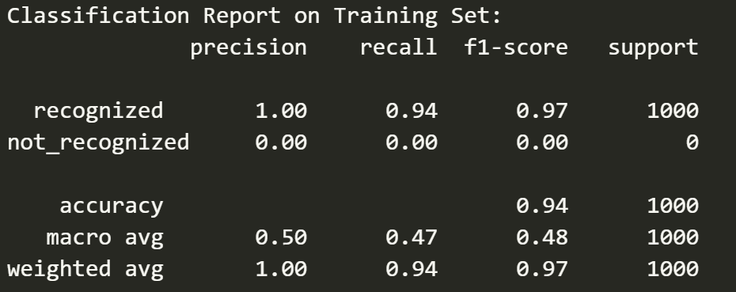
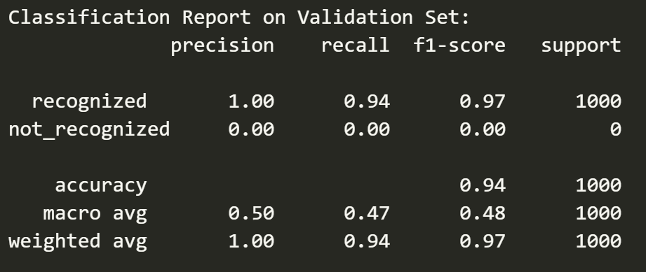

# 🧪 Face Analysis Evaluation Scripts

This repository provides scoring scripts for:

- ✅ **Task A: Gender Classification**
- ✅ **Task B: Face Recognition (Binary Verification)**

---

## 🔧 Setup

Install required libraries:

```bash
pip install -r requirements.txt
```

Required config files:

[Download Face Embeddings from Google Drive](https://drive.google.com/file/d/1ObtkkYKOJGIJucQQTOQF7R_G9tOU7NLz/view?usp=sharing)

[Download Gender model weights from Google Drive](https://drive.google.com/file/d/10WenJR1PqJGp_stcZkEERY7AxE1v231f/view?usp=sharing)

[Download ArcFace model weights from Google Drive](https://drive.google.com/file/d/1p7LM_NhbGcf6eff-2pdmuZn83nIx7XSs/view?usp=sharing)


## 🧠 Task A – Gender Classification

We used the **CLIP (Contrastive Language-Image Pretraining) ViT-B/32 model** to extract image features then apply an MLP head to classify the gender of the person in the images.


We have provided our training jupyter notebook **clip-genderclassification.ipynb** which has the validation result and the training result is provided in the **taska-scoregenerator.ipynb**.

We have also made a separate **score_task_a.py** which can be used a tool to classify images. To classify images using the scorer file a sample Test folder structure is given below and also in the repo.

### 📁 Test Folder Structure
```

val_task_a/
├── male/
│   ├── img1.jpg
│   ├── img2.jpg
│   └── ...
├── female/
│   ├── img1.jpg
│   ├── img2.jpg
│   └── ...

```
After having the above folder structure download the **model_weights.pt** from gdrive and use the below command line prompt to run the scorer.

```bash
python score_task_a.py --val_path ./val_task_a --weights_path ./saved_model/model_weights.pt
```

### Results



## 🧠 Task B – Face Recognition

We used a retriever model based on **ArcFace Face Embeddings** and vectorDB **ChromaDB** to make the Face Recognition model.



We have also provided with model development jupyter notebook **task_B_dev.ipynb**. We have used the ArcFace model through the **DeepFace** package's interface and stored all the face embeddings in ChromaDB with labels as metadata.

We have provided the **faces_collection.json** in gdrive which has the embeddings collection. **score_task_b.py** can be used to do face recognition based on FaceCOM dataset.


### 📁 Test Folder Structure

```
val_task_b/
├── Person_A/
│   ├── img.jpg
│   └── distortion/
│       └── distorted_1.jpg
├── Person_B/
│   ├── ...
```

```bash
python score_task_b.py --val_path ./val_task_b --collection faces_collection.json
```

### Results


